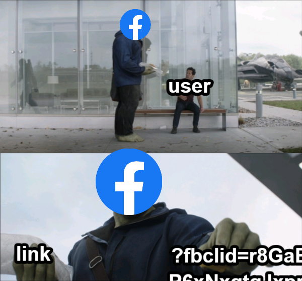
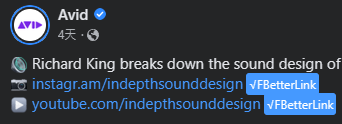
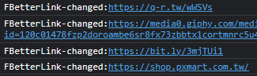

# FBetterLink
Author:sstteeeenn05
### Say goodbye to Facebook link tracker

## How to use?
Just browsing Facebook normally. 
The program will automatically change the links. 
The link without Facebook tracker will be marked by a blue tag. 
It may like this: 
 
If you see this, congratulations, you can enjoy clicking link without Facebook tracking.

### You can alse check which link was changed in console:
