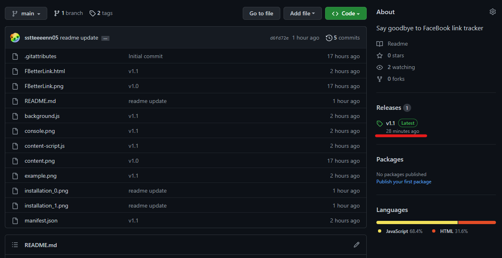
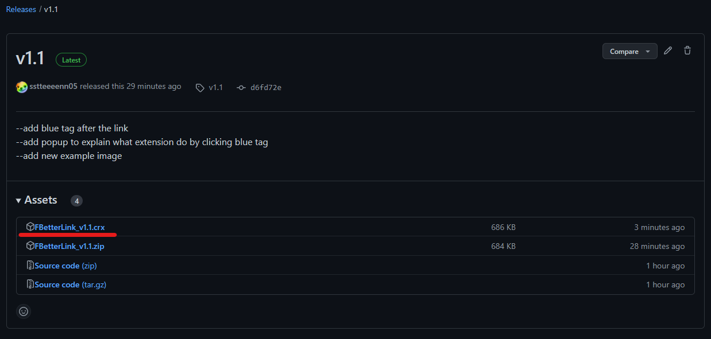
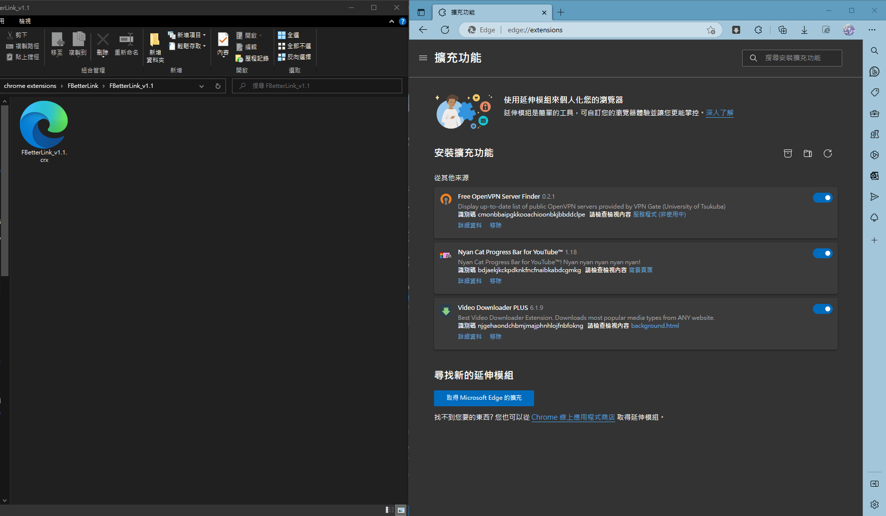
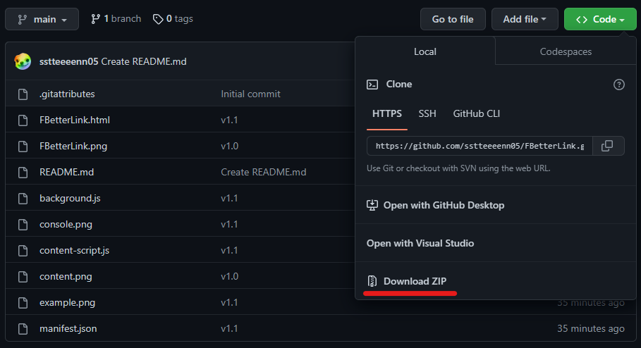
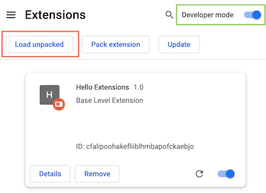

# FBetterLink
Say goodbye to Facebook link tracker<br/>


## Requirement
Google Chrome or Microsoft Edge

## Release Installation
1. Go to Release of this repository.<br/>


2. Download FBetterLink_(version).crx<br/>


3. Go to the Extensions page of your browser. ```chrome://extensions``` or ```edge://extensions```<br/>
4. Drag and drop the crx file to the page.<br/>


The extension will be installed by your browser.

## Non-Release Installation (For Test only)
1. Download this repository as zip, and extract it.<br/>


2. Go to the Extensions page of your browser. ```chrome://extensions``` or ```edge://extensions```<br/>


3. Open Developer mode then click "Load unpacked", select the folder which just extracted.<br/>
The extension will be installed by your browser.

## How to use?
Just browsing Facebook normally.<br/>
The program will automatically change the links.<br/>
The link without Facebook tracker will be marked by a blue tag.<br/>
It may like this:<br/>
<br/>
If you see this, congratulations, you can enjoy clicking link without Facebook tracking.

### You can alse check which link was changed in console:
