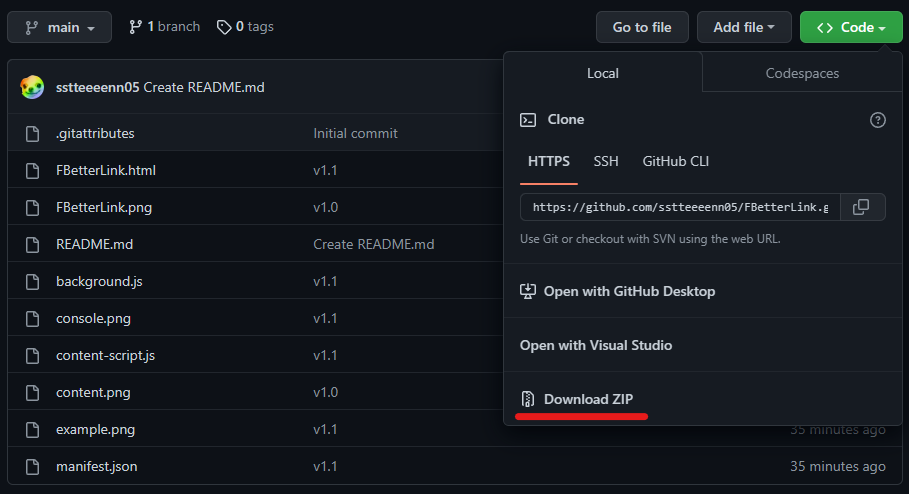
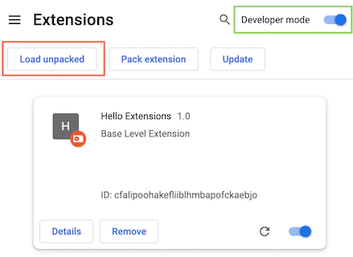

# FBetterLink
Author:sstteeeenn05
### Say goodbye to Facebook link tracker

## Requirement
Google Chrome or Microsoft Edge

## Installation
Download this repository as zip, and extract it. 
 
Go to the Extensions page of your browser. [Chrome](chrome://extensions) / [Edge](edge://extensions) 
 
Open Developer mode then click "Load unpacked", select the folder which just extracted. 
The extension will be installed by your browser. 

## How to use?
Just browsing Facebook normally. 
The program will automatically change the links. 
The link without Facebook tracker will be marked by a blue tag. 
It may like this: 
 
If you see this, congratulations, you can enjoy clicking link without Facebook tracking.

### You can alse check which link was changed in console:
